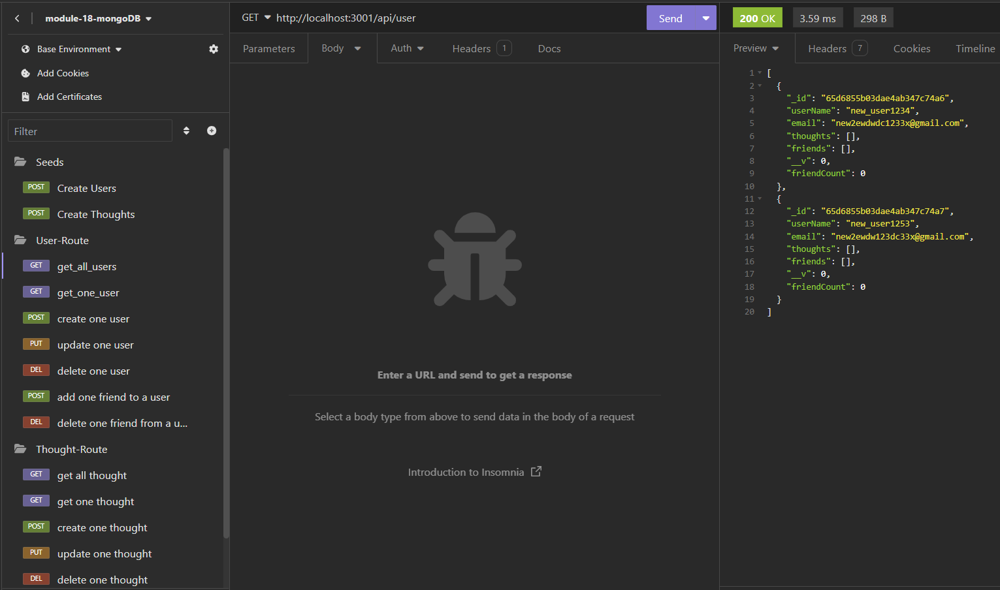

# Social Network backend -ylf456

## Description

This Social Network backend app, created by ylf456 for study purposes, utilizes JavaScript, Node.js, MongoDB and Mongoose.

## Installation

To set up this application, ensure you have the following:

- Code editor
- Javascript
- Node.js
- MongoDB

and install the required npm packages: express, mongoose.

## Usage

Before using the application, install the latest version of Node.js, MongoDB, and a code editor (such as VS Code) on your device. 
Download the application folder from the following GitHub repo: https://github.com/ylf456/module-18-challenge-ylf456-Social-Network-API.git
 

To use this application:

1. Open the terminal in your code editor and change the directory to root folder.
2. type `npm i` in the terminal to install the required npm package .
3. type `npm run start` or `npm start` to sync the database and turn on server.
4. testing out the routes with `get` , `post`, `put` and `delete` calls on your local server.

Also refer to the demo video for more details: 
 https://drive.google.com/file/d/16O8elfDu8X7ZGSSEPywmFdVXhKNzfpVA/view

## Credits

N/A

## License

MIT License

Copyright (c) 2024 ylf456

Permission is hereby granted, free of charge, to any person obtaining a copy
of this software and associated documentation files (the "Software"), to deal
in the Software without restriction, including without limitation the rights
to use, copy, modify, merge, publish, distribute, sublicense, and/or sell
copies of the Software, and to permit persons to whom the Software is
furnished to do so, subject to the following conditions:

The above copyright notice and this permission notice shall be included in all
copies or substantial portions of the Software.

THE SOFTWARE IS PROVIDED "AS IS", WITHOUT WARRANTY OF ANY KIND, EXPRESS OR
IMPLIED, INCLUDING BUT NOT LIMITED TO THE WARRANTIES OF MERCHANTABILITY,
FITNESS FOR A PARTICULAR PURPOSE AND NONINFRINGEMENT. IN NO EVENT SHALL THE
AUTHORS OR COPYRIGHT HOLDERS BE LIABLE FOR ANY CLAIM, DAMAGES OR OTHER
LIABILITY, WHETHER IN AN ACTION OF CONTRACT, TORT OR OTHERWISE, ARISING FROM,
OUT OF OR IN CONNECTION WITH THE SOFTWARE OR THE USE OR OTHER DEALINGS IN THE
SOFTWARE.

## Link to this application

Demo video: https://drive.google.com/file/d/16O8elfDu8X7ZGSSEPywmFdVXhKNzfpVA/view

github Repo: https://github.com/ylf456/module-18-challenge-ylf456-Social-Network-API.git

## Screenshots

